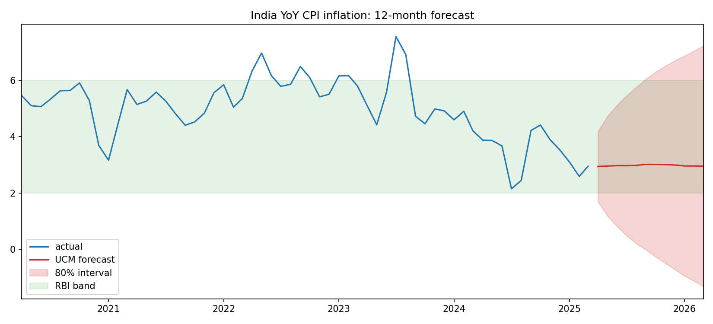
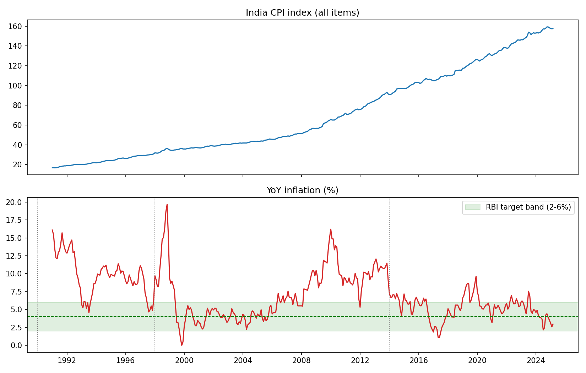

# India Inflation Forecasting

One-month-ahead and 12-month-ahead forecasting of India's headline CPI (YoY)
inflation, comparing classical, structural state-space and machine-learning
approaches against naive benchmarks, evaluated with a rolling-origin backtest
and Diebold-Mariano significance tests.

## Why this problem

Inflation is the single most-watched macro variable in India: the RBI's
Monetary Policy Committee targets 4% (+/- 2%) CPI inflation, and every basis
point matters for rate decisions. Forecasting it well is hard because the
series mixes strong seasonality (food prices), structural breaks (the 2016
shift to flexible inflation targeting), and base effects that mechanically
move YoY numbers.

## Data

| Source | Series | Notes |
|---|---|---|
| FRED (primary) | `INDCPIALLMINMEI` | India CPI all-items index, monthly, from OECD MEI |
| DBnomics (fallback) | `IMF/CPI/M.IN.PCPI_IX` | IMF CPI database mirror |

Both sources are free, keyless, and fetched programmatically: the entire
pipeline reproduces from a fresh clone with no manual downloads.

## Models

1. **Naive baselines**: random walk and 3-year seasonal mean. Any model that
   cannot beat these is not worth deploying.
2. **SARIMA**: AIC grid search over (p,1,q)(P,0,Q)12.
3. **Unobserved Components (structural / BSTS-style)**: local level +
   stochastic seasonal, state-space estimation; provides principled
   prediction intervals.
4. **LightGBM**: gradient boosting on leakage-safe features: AR lags,
   rolling statistics, calendar dummies, momentum gap, and an explicit
   **base-effect** term (the year-ago MoM print about to drop out of the
   YoY window). Quantile objectives give P10/P90 intervals.

## Evaluation

Rolling-origin (expanding window) backtest from 2015 onwards: at each monthly
origin, models see only past data and predict the next month. SARIMA order is
re-selected and all models refit every 12 origins. Reported: MAE, RMSE, bias,
and the Diebold-Mariano test versus the random-walk baseline.

## Results

Rolling-origin backtest, 122 one-month-ahead forecasts from February 2015 to March 2025 (the
FRED series ended at March 2025 when it was pulled). From `reports/backtest_summary.csv`, with
every prediction in `reports/backtest_predictions.csv`:

| Model | MAE (pp) | RMSE (pp) | Bias (pp) | DM vs random walk | p-value |
|---|---|---|---|---|---|
| SARIMA | 0.405 | 0.529 | +0.13 | -3.63 | 0.0004 |
| LightGBM | 0.547 | 0.762 | +0.17 | -0.15 | 0.885 |
| Random walk | 0.580 | 0.769 | +0.03 | | |
| UCM | 0.589 | 0.782 | +0.04 | +4.10 | 0.0001 |
| 3-year seasonal mean | 1.869 | 2.395 | +0.77 | +7.34 | <0.0001 |

A negative DM statistic means lower squared error than the random walk.

Only SARIMA beats the random walk by more than noise, cutting MAE by 30%. LightGBM's lower
MAE is not distinguishable from carrying last month's print forward (p = 0.88), and UCM is
significantly worse than the random walk. For a series this persistent the random walk is the
benchmark that matters, and most of the models here do not clear it.

That creates an inconsistency worth stating: `src/forecast.py` builds the 12-month path with
UCM, chosen for its state-space intervals, even though the backtest ranks it below the random
walk one month ahead. The path holds near 2.9 to 3.0% with an 80% band that widens from
1.7 to 4.2% in April 2025 to -1.3 to 7.2% by March 2026. Switching the path to SARIMA is the
obvious next change.



Across policy regimes (`reports/regime_summary.csv`), mean inflation falls from 9.8% in
1990 to 1997 to 7.2% in 1998 to 2013 and 5.2% from 2014, and the share of months inside the
2 to 6% band rises from 13% to 47% to 67%.



## Reproduce

```bash
pip install -r requirements.txt
python src/data_ingestion.py   # fetch + clean CPI, derive YoY/MoM inflation
python src/eda.py              # trends, seasonality, STL, ACF/PACF, regimes
python src/features.py         # leakage-safe feature matrix
python src/backtest.py         # rolling-origin backtest + DM tests
python src/forecast.py         # 12-month forecast with 80% intervals
streamlit run app/streamlit_app.py
```

## Repository layout

```
src/            pipeline modules (ingestion -> eda -> features -> backtest -> forecast)
app/            Streamlit dashboard
reports/        backtest results, forecasts, figures (the ones cited above are committed)
data/           raw and processed series (generated, gitignored)
config.yaml     every knob in one place
```

## Honest limitations

* Headline CPI only: a food/fuel/core decomposition would sharpen the story
  but MoSPI component series need manual assembly.
* Univariate + calendar features; no exchange rate, crude oil, or monsoon
  covariates yet (natural next step).
* YoY inflation is a smoothed target; MoM SAAR forecasting is harder and
  more operationally useful for policy desks.
